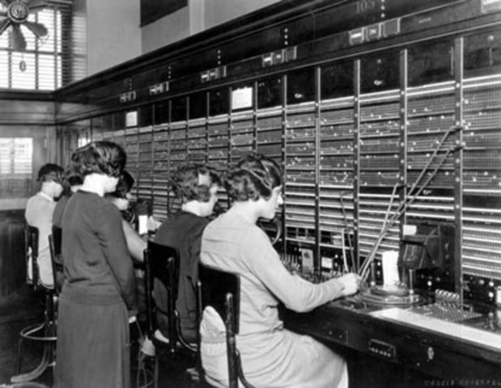

## Trabajo practico integrador - Programacion Concurrente

Elegir o inventar un problema donde usar concurrencia sea beneficioso y/o necesario. Si están presentes las dos cosas mucho mejor.

- En general, cuanto más compleja la situación mejor, pero no es una regla inviolable sino un hilo conductor de la tarea.

- En general, cuanto más original la situación respecto de lo visto en la cursada mejor, pero no es una regla inviolable sino un hilo conductor de la tarea.

- La tarea es individual.

- Se entrega código, enunciado del problema y explicación de beneficios y/o necesidades de la concurrencia.
Puede haber un anexo con cosas, quizás un tanto al margen, que deseen incluir.

- Citar material, sitios, bibliografía, etc. utilizados, en caso de corresponder, tanto para elegir el problema, como para realizar el código y las explicaciones de beneficios y/o necesidades de la concurrencia.
Poner las citas explicitando la o las partes utilizadas y explicando brevemente para qué fueron usadas.

- La claridad, simpleza, coherencia, honestidad intelectual, ortografía, argumentaciones y producciones propias de la entrega, serán muy tenidas en cuenta.

- Se pueden usar herramientas y/o lenguajes no vistos durante la cursada, pero utilizar lo visto esta perfecto.

## Campanas al Sur

Estamos en 1989, la empresa “Campanas al Sur” llega al país para iniciar el mercado de telefonía celular.

La empresa nos contrata para crear el primer sistema de cobro de llamadas celulares.

Como el servicio todavía es muy caro y solo algunos pocos afortunados pueden pagarlo la cantidad de suscriptores iniciales es de 10 personas, pero puede crecer más adelante.

Un detalle a tener en cuenta, como estamos en 1989 y las bases de datos transaccionales todavía no están en auge, vamos a tener que utilizar otro método para almacenar los consumos y recargas de los abonados, un archivo, arrays, variables, etc.

## Requerimientos

1. Simular el paso de los días, donde los abonados por un lado consumen saldo de las líneas al realizar llamadas ($2 el minuto) y por otro, un operador realiza recargas diarias a todos los abonados ($3 por dia).

2. Tener en cuenta que:

- Los abonados cuentan con un saldo inicial de $3.

- Mientras haya una llamada en curso, no se pueden realizar recargas y si se esta haciendo una recarga, no se pueden realizar llamadas.

- Cuando el abonado no tenga saldo suficiente para realizar una llamada, tendrá que esperar a que el operador le asigne la recarga diaria y le "avise" que la misma esta hecha.

3. La empresa tuvo éxito y ahora suma el servicio de mensajes de texto (SMS) con un costo de $1 cada uno. Permitir que los abonados envíen mensajes de texto teniendo en cuenta que estos terminales no son multitareas.

## beneficios y/o necesidades de la concurrencia

Pensando en que presentar como trabajo final para la materia se me vinieron a la mente diferentes problemas relacionados con la concurrencia en la programación.

Creo que una vez que comprendes la importancia de la concurrencia para el desarrollo de software es imposible dejar de asociar esto con cualquier tarea que realizamos diariamente.

Entre todos los ejercicios que fui pensando, el planteado fue el que mas me gustó, por ahí porque hace años trabajo en una compañía telefónica y pude relacionarlo con diferentes procesos que veo funcionando día a día. Es verdad que la escala entre la operación real y el ejercicio planteado es incomparable.

Dejemos de lado por un momento las operaciones concurrentes que realiza un teléfono inteligente de hoy en día, porque mas que teléfonos celulares son computadoras con capacidades de procesamiento en algunos casos superior a muchas PCs. 

Vamos a seguir la temática planteada en el enunciado del ejercicio y viendo la foto viajaremos mentalmente a principios del siglo veinte.

¿Como se establecía una llamada telefónica en esa época? 
Levantabas el tubo, el teléfono emitía una señal que se reflejaba en la centralita donde te atendía una operadora. Luego ella te comunicaba con el numero al que querías hablar, así de simple.

Una operadora solo podía atender una llamada a la vez, en este caso no había concurrencia.
Por otro lado, como vemos en la foto, no había solo una operadora, sino varias, que podían hacer la misma tarea simultáneamente. Entonces ¿Existía el paralelismo, pero no la concurrencia?
¿Que pasaba cuando dos operadoras querían conectar dos llamadas de dos personas distintas a un mismo numero? Supongo que habría prioridades, o desempatarían de alguna forma que no sabemos. ¿Un posible semáforo?

Volviendo a la actualidad, hoy en día un abonado ejecuta cientos de tareas por día, incluso sin darse cuenta ya que el teléfono esta enviando constantemente información a través de Internet. 

Planteemos un ejemplo real donde veamos que la concurrencia es necesaria:

Un abonado realiza una llamada telefónica y al mismo tiempo contesta mensajes por WhatsApp. En ese caso y simplificando la operación, tenemos dos rodajas tomadas en curso. O sea, del saldo que tenemos disponible de las muchas bolsas que disponemos (recargas, saldo promocional, bonos, etc.) tomamos saldo solo de la bola de recargas. 
La rodaja de DATOS es de 10mb y la rodaja de VOZ es de 6 minutos (Una rodaja es una porción determinada que se reserva del saldo disponible para evitar que, al realizar el cobro, el abonado ya no tenga saldo donde descontar el consumo realizado).

Supongamos ahora que al mismo tiempo cortamos la llamada y se cierra la sesion de datos. Esto va a generar dos cobros diferentes, pero sobre la misma bolsa, la de recargas.

Bueno, en este caso tenemos operaciones concurrentes que dispondrán de las medidas necesarias para que una posible desconciliación se reduzca al mínimo. 

Digo que se reduzca al mínimo y no que no exista porque cada tanto en una plataforma con millones de abonados que realizan millones de operaciones por segundo cabe la posibilidad que el sistema falle y genere una desconciliación, que dada mi experiencia puedo decir que en el 99% de casos es debido a problemas en el código.

Todo esto me lleva a pensar que es imposible plantearse una plataforma que realice millones de operaciones por segundo sin utilizar concurrencia. Por esto, considero que la concurrencia es indispensable y que juega un papel importante, ya que aceleramos el tiempo de respuesta y optimizamos recursos, pero todo esto tiene un costo ya que si no realizamos una buena planificación al momento de desarrollar un sistema podemos tener grandes dolores de cabeza.

## Referencias
La idea para armar este ejercicio y los ejemplos dados para poder llegar a una conclusión que defienda mi punto de vista referidos a la necesidad de utilizar la concurrencia están basados en conocimientos que fui adquiriendo como sysadmin de una empresa de telefonía, como así también de los textos leídos durante la cursada y la resolución de los ejercicios que fueron planteados en la materia.
